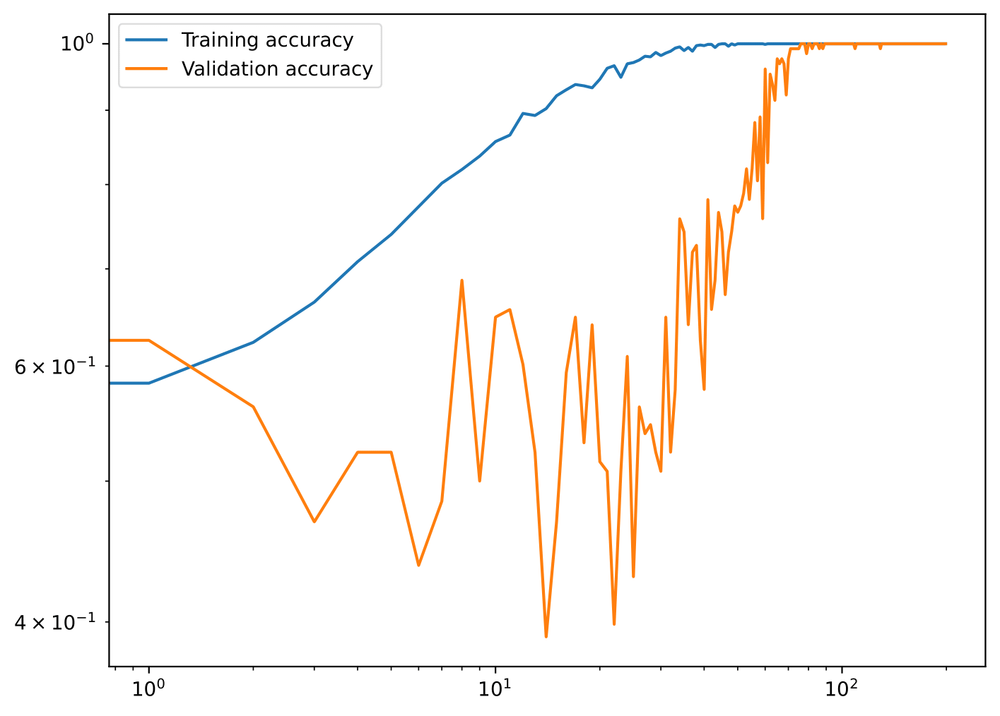

# tiny-gen

This repository contains code for a Toy Model of generalisation to test claims regarding grokking, the over-parameterised regime, double descent etc.

## Tasks

We currently maintain one mathematical task to analyse generalisation. The so-called parity-prediction task.

> Given a sequence $x$ of length $n$ and a k_factor $k$, predict the parity of the number of 1s in the sequence $x[:k]$ given knowledge of the sequence $x[:k]$ and the value of $k$.

## Models

Currently we use a feedforward neural network with a single hidden layer. The hidden layer has a ReLU activation function. The number of hidden units is a hyperparameter.

## Experiments

There are several experiments which have been conducted so far with the repository. These are:
* Grokking under the original paper's parameters
* Generalisation with a normal model (1000 data points, 1000 parameters). See `ting-gen.py` for the code under `experiment_1`.
* Grokking with an over-parameterised model. We will we say OOD performance with an over-parameterised model given enough parameters. See `ting-gen.py` for the code under `experiment_2`.

### Experiment 0

In experiment 0 we look to recover the grokking from the original paper and here it is

