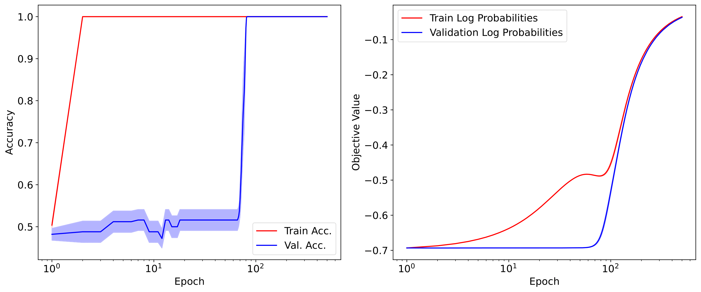
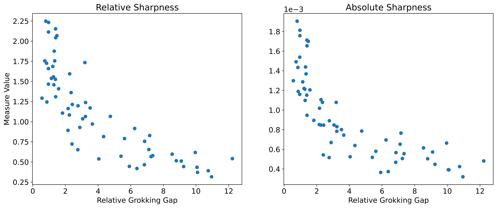

# tiny-gen

This repository contains code for two papers.
* _Grokking Beyond Neural Networks_, which is currently under review at Transactions of Machine Learning Research. It can be found here: https://arxiv.org/abs/2310.17247.
* _Measuring Sharpness in Grokking_, which is currently under review for the workshop Bridging the Gap Between Practice and Theory in Deep Learning. It can be found here: https://arxiv.org/pdf/2402.08946.pdf.

## Running the Repository

All results are produced from the file `tiny-gen.py` by specifying using an argument which experiments one wishes to run.

```
python3 tiny-gen.py --experiments [experiments]
```

For example, to run the code to generate MLP plots for _Measuring Sharpness in Grokking_, one would use the following command under the branch `feat/sharpness-and-gap`:

```
python3 tiny-gen.py --experiments sharpness_and_grokking_gap
```

## Environment

Concerning the environment, the repository is setup for the Gadi cluster at NCI. If you are using that facility, run `module load pytorch/1.10.0`. This should set the correct Python and PyTorch versions, however, smaller libraries like `tqdm` need to be installed manually through the following command (after enabling the module):
```
python3 -m pip install [package_name] --user
```

## Results

There exist several interesting results from the repository. For example, here is the first recorded instance of grokking in GPs under hyperparameter optimisation!



Alternatively, here are some trends in sharpness with relative grokking gap in an MLP completing the parity prediction problem.


